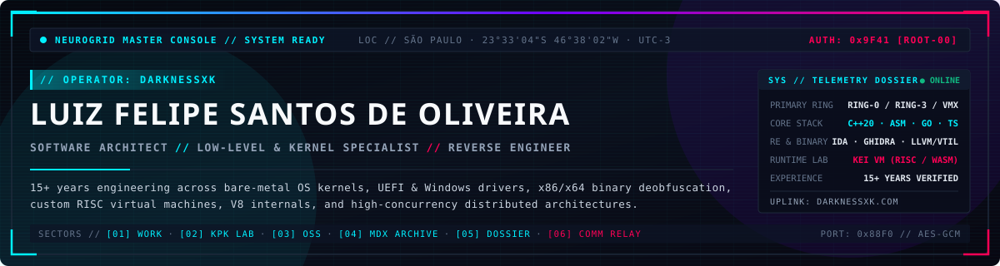

<div align="center">
  <a href="https://darknessxk.com/en-US">
    
  </a>

  <br />

  <p>
    <a href="https://darknessxk.com/en-US">
      
    </a>
    <a href="https://darknessxk.com/en-US/lab">
      
    </a>
    <a href="https://darknessxk.com/en-US/writing">
      
    </a>
    <a href="https://www.linkedin.com/in/darknessxk">
      
    </a>
    <a href="mailto:luiz.felipe.techq@gmail.com">
      
    </a>
  </p>
</div>

---

## `// 00 · IDENTITY DOSSIER & KNOWLEDGE BACKGROUND`

```yaml
operator      : "Luiz Felipe Santos de Oliveira (darknessxk)"
location      : "São Paulo - SP, Brazil (UTC-3)"
experience    : "15+ Years across Systems, Architecture, Security & Full-Stack Engineering"
primary_focus : ["C/C++ (C++17/20)", "x86/x64 Assembly", "Reverse Engineering", "Kernel & Hypervisors", "Distributed Systems"]
status        : "Open to Senior/Staff Engineering, Systems Architecture & Security Research Roles"
```

I'm **Luiz Felipe (`darknessxk`)** — a **Software Architect, Senior Software Developer, Reverse Engineer, and Low-Level Systems Specialist** with over **15 years of hands-on technical depth**.

My engineering journey started in native **C++**, **C#**, **DirectX/OpenGL**, and raw **TCP/UDP** network programming before expanding into large-scale distributed backend architectures, cloud infrastructure, and modern web/mobile ecosystems. While I have architected production microservices, React Native platforms, and event-driven pipelines for enterprise organizations, my deepest passion has always lived **beneath the abstraction layer** — where code meets silicon, operating system kernels, and raw memory layouts.

Today, my work and research bridge **two worlds that rarely intersect**:

- **Ring-0 to Ring-3 & Bare-Metal Internals**: Engineering end-to-end **UEFI pre-boot (`EDK II` DXE/PEI) to Windows Kernel Drivers (`KMDF`/`WDM`, `WRK`/`ntoskrnl`)**, bare-metal OS kernels (Real → Protected → Long mode bootloaders, paging, IDT/GDT, preemptive schedulers), **Intel VT-x hypervisors with EPT hooking**, custom **RISC virtual machines & compilers**, and **V8 VM memory injection engines**.
- **Binary Deobfuscation, Malware Research & Offensive Security**: Dissecting proprietary binaries and obfuscated/virtualized protectors (**VMProtect**, **Themida**) using **IDA Pro**, **Ghidra**, **LLVM IR lifting**, **VTIL optimization pipelines**, symbolic execution, API hooking (**Detours**, **lazy_importer**, IAT/inline hooks), and autonomous **Local AI + MCP reverse-engineering harnesses**.
- **High-Concurrency Production Architecture**: Designing fault-tolerant distributed backends (**Go**, **Node.js**, **Java**, **C++**), custom embedded **IPv6 protocol stacks** and **IPS/IDS/UTM security appliances**, high-throughput **Apache Kafka** streams (1–2M+ events/day), **Tauri + C++ IPC** desktop applications, and complex **React Native / Next.js / WebGPU** client runtimes.

---

## `// 01 · TECHNICAL ARSENAL & ARCHITECTURE MATRIX`

<table>
  <thead>
    <tr>
      <th width="28%">Sector</th>
      <th width="72%">Core Technologies &amp; Engineering Depth</th>
    </tr>
  </thead>
  <tbody>
    <tr>
      <td><b>⚙️ Low-Level, Kernel &amp; Virtualization</b></td>
      <td>
        
        
        
        
        
        
        
        <br />
        <sub>Pre-OS manual mapping, multi-stage bootloaders (Real/Protected/Long mode), paging tables, IDT/GDT, IRP dispatching, VMCS configuration, EPT memory isolation, SMBIOS firmware introspection.</sub>
      </td>
    </tr>
    <tr>
      <td><b>🔍 Reverse Engineering &amp; Offensive Security</b></td>
      <td>
        
        
        
        
        
        
        <br />
        <sub>Routine devirtualization (VMProtect/Themida), symbolic execution, reflective PE loading, TLS slot manipulation, V8 isolate/heap traversal, anti-tamper telemetry, IPS/IDS &amp; UTM packet inspection.</sub>
      </td>
    </tr>
    <tr>
      <td><b>🧠 Compilers, VMs &amp; Autonomous AI Tooling</b></td>
      <td>
        
        
        
        
        
        <br />
        <sub>Lexer/Parser AST pipelines, custom bytecode emitters, cycle-accurate 32-bit vCPU emulation (Kei VM), MMIO &amp; XVM bus, headless Ghidra + Local LLM MCP agents for automated struct recovery.</sub>
      </td>
    </tr>
    <tr>
      <td><b>🌐 Distributed Systems &amp; Network Protocols</b></td>
      <td>
        
        
        
        
        
        
        
        
        
        <br />
        <sub>RFC-compliant embedded IPv6 stacks from scratch (zero-copy DMA, NDP/SLAAC, radix routing), lock-free ring buffers, PHP-to-C++ FFI bridges, high-concurrency event streaming, GCP &amp; Azure.</sub>
      </td>
    </tr>
    <tr>
      <td><b>🖥️ Frontend, Desktop, Mobile &amp; Spatial Web</b></td>
      <td>
        
        
        
        
        
        
        <br />
        <sub>Large-scale React Native migrations &amp; custom Metro Bundler architectures, lightweight Tauri desktop apps backed by C++ &amp; ZeroMQ, deterministic WebGPU spatial runtimes, Storybook design systems.</sub>
      </td>
    </tr>
  </tbody>
</table>

---

## `// 02 · FEATURED SYSTEMS, RESEARCH & OPEN SOURCE`

> Explore live interactive WebContainer sandboxes, architectural dossiers, and technical post-mortems on [**darknessxk.com**](https://darknessxk.com/en-US).

### 🔬 Low-Level Systems, Virtual Machines & Reverse Engineering

| Module | Stack | Architectural Summary | Links |
| :--- | :--- | :--- | :--- |
| **Project Kaito** | `C++` `LLVM IR` `VTIL` `Symbolic Exec` `MCP` | Autonomous reverse-engineering and binary deobfuscation harness engineered to defeat virtualization packers (**VMProtect** / **Themida**) and code mutation via LLVM lifting, VTIL optimization passes, and agentic orchestration. | [📄 Research Log](https://darknessxk.com/en-US/writing/kaito-automated-reverse-engineering-harness) |
| **Kei Virtual Machine (`vm/v1`)** | `C++17` `Custom RISC ISA` `WebAssembly` `MMIO` | End-to-end compiler pipeline (Lexer/Parser AST to custom RISC bytecode) and cycle-accurate 32-bit vCPU emulator with deterministic WebAssembly compilation, MMIO subsystems, and cross-instance XVM bus. | [📄 Architecture Log](https://darknessxk.com/en-US/writing/kei-virtual-machine-architecture-and-runtime) |
| **Kat App Loader & V8 Injector** | `C++` `x86/x64 ASM` `V8 Internals` `gRPC` | Low-level binary sideloading engine performing reflective PE loading, IAT hooking, V8 isolate heap traversal & live script injection, and encrypted gRPC binary streaming. | [🛠️ Case Study](https://darknessxk.com/en-US/work/kat-app-loader) · [📄 Deep Dive](https://darknessxk.com/en-US/writing/v8-vm-memory-injection-internals) |
| **Embedded IPv6 Stack & UTM Engine** | `C++` `x86/x64 ASM` `Embedded Linux` `IPv6` `FFI` | RFC-compliant IPv6 network protocol stack built from scratch for **Blockbit** security appliances: zero-copy DMA buffers, chained extension headers, NDP/SLAAC state machine, lock-free flow tracking, and IPS/IDS/UTM inspection. | [🛠️ Case Study](https://darknessxk.com/en-US/work/embedded-ipv6-stack) · [📄 RFC Log](https://darknessxk.com/en-US/writing/implementing-ipv6-protocols-from-scratch) · [🧪 Live Lab](https://darknessxk.com/en-US/lab/ipv6-packet-analyzer) |
| **UEFI Pre-Boot & Kernel Pipeline** | `C/C++` `EDK II` `KMDF/WDM` `WRK` `x64 ASM` | End-to-end execution chain from UEFI DXE/PEI pre-boot drivers performing pre-OS manual memory mapping into Windows kernel-mode drivers with custom IRP dispatching. | [🗂️ Dossier](https://darknessxk.com/en-US/about) · [📦 `ntoskrnl` (WRK)](https://github.com/darknessxk/ntoskrnl) |
| **Bare-Metal OS & VT-x Hypervisor** | `C++` `x86/x64 ASM` `Intel VT-x` `EPT` | Custom multi-stage bootloader (Real → Protected → Long mode), paging, IDT/GDT, and preemptive scheduler paired with a Type-1/2 Intel VT-x hardware hypervisor utilizing EPT hooking for memory isolation. | [🗂️ Dossier](https://darknessxk.com/en-US/about) |

### 🌐 Open Source Modules, Live Labs & Toolchain Forks

- **[Kat Node HWID — Native Hardware Fingerprinting](https://darknessxk.com/en-US/oss/kat-node-hwid)** (`Node.js` · `C++` · `N-API` · `SMBIOS`)
  Zero-overhead native C++ N-API addon querying raw SMBIOS Type 1 & Type 2 motherboard tables for cryptographic HMAC machine fingerprinting and anti-tamper telemetry without spawning external subshells.
- **[Go In-Memory Redis Engine & RESP2 Wire Parser](https://darknessxk.com/en-US/oss/go-redis-server)** (`Go` · `RESP2 Protocol` · `Concurrency` · `Networking`)
  High-concurrency in-memory key-value store and complete RESP2 wire protocol parser implemented from scratch in Go with goroutine-per-connection non-blocking I/O and mutex-sharded storage. [**→ Run Live in Browser Lab**](https://darknessxk.com/en-US/lab/resp-redis-engine)
- **[Neurogrid Spatial Runtime & KPK Sandbox Matrix](https://darknessxk.com/en-US/writing/architecting-the-neurogrid-portfolio)** (`TypeScript` · `Next.js` · `WebGPU/WebGL` · `WebContainers` · `LZ4`)
  The architecture behind `darknessxk.com`: a neo-cyberpunk single-canvas spatial UI paired with **Kei Packed (`KPK`)** LZ4-compressed in-browser virtual sandboxes and procedural Web Audio API sound synthesis. [**→ Launch Cyber Canvas GL Lab**](https://darknessxk.com/en-US/lab/cyber-canvas-gl)
- **Public Low-Level & RE Reference Repositories**:
  - [`darknessxk/cmkr`](https://github.com/darknessxk/cmkr) — Modern C/C++ build system based on CMake and TOML.
  - [`darknessxk/Detours`](https://github.com/darknessxk/Detours) — Windows API monitoring and inline function instrumentation library.
  - [`darknessxk/lazy_importer`](https://github.com/darknessxk/lazy_importer) — Compile-time hashed PE export table resolution for reverse-engineering-resilient C++ binaries.
  - [`darknessxk/ntoskrnl`](https://github.com/darknessxk/ntoskrnl) — Windows Research Kernel (WRK) reference tree for kernel internals research.

---

## `// 03 · VERIFIED CAREER NODES (EXPERIENCE SUMMARY)`

- **Accenture Brasil** — *Senior Software Developer* `(2025)`
  Spearheaded complex **React Native (v0.64 → v0.81)** architectural migrations, engineered custom **Metro Bundler** asset/module resolution pipelines, established **Storybook** testing standards, and mentored engineering teams.
- **Planeta Visto** — *Software Architect* `(2024)`
  Architected a low-footprint desktop contract automation suite combining **Tauri**, **React**, **TypeScript**, and a native **C++ / ZeroMQ** backend via lightweight IPC.
- **iK Solutions** — *Software Architect* `(2024)`
  Conducted offensive/defensive vulnerability research across legacy codebases, patched RCE/injection vectors, and hardened containerized **Docker / Apache2** production environments.
- **EOS Loan** — *Software Architect* `(2023 – 2024)`
  Architected core lending microservices (**Node.js**, **TypeScript**, **MongoDB**, **Azure**) boosting throughput by 15%, alongside custom **React Native** Metro build pipelines and **Xcode Cloud** CI/CD.
- **Alares Internet** — *Software Architect* `(2023)`
  Led end-to-end legacy modernization into **NestJS** BFF microservices, **Next.js** web portals, and **Flutter** mobile apps on **GCP** with **Docker** and **GitLab CI/CD**.
- **CompreAlugueAgora** — *Software Developer* `(2023)`
  Engineered the migration from a monolithic architecture to a distributed **Java** & **Elixir** microservices ecosystem backed by **Apache Kafka** processing **1–2 million events/day** with zero data loss.
- **Blockbit** — *Software Developer* `(2021 – 2022)`
  Engineered a proprietary embedded **IPv6** networking stack and **C++** microframework from the ground up for **IPS/IDS & UTM** security appliances, bridged to management APIs via **PHP-to-C++ FFI** and **ZeroMQ/AMQP**.
- **InfoFeisa** — *Software Developer* `(2009 – 2015)`
  Built high-performance **C++**, **DirectX**, and **OpenGL** desktop graphics applications, multi-threaded **TCP/UDP** wire protocols, and mission-critical POS systems.

---

## `// 04 · TECHNICAL WRITING & MDX ARCHIVE LOGS`

I write deep-dive architectural essays and post-mortems to demystify low-level systems, binary analysis, and local AI orchestration:

- 📘 [**Project Kaito: Autonomous Binary Deobfuscation & Virtualization Analysis via LLVM Lifting and VTIL**](https://darknessxk.com/en-US/writing/kaito-automated-reverse-engineering-harness)
- 📘 [**Kei Virtual Machine Architecture: High-Performance Emulation, MMIO & The Road to 64-Bit RE**](https://darknessxk.com/en-US/writing/kei-virtual-machine-architecture-and-runtime)
- 📘 [**V8 VM Memory Injection & Binary Sideloading Internals**](https://darknessxk.com/en-US/writing/v8-vm-memory-injection-internals)
- 📘 [**Implementing IPv6 Protocols from Scratch in Embedded C++**](https://darknessxk.com/en-US/writing/implementing-ipv6-protocols-from-scratch)
- 📘 [**Autonomous Local AI Agents for Binary Reverse Engineering & Headless Ghidra Decompilation**](https://darknessxk.com/en-US/writing/local-ai-reverse-engineering-and-autonomous-tooling)
- 📘 [**Architecting the Neurogrid: Engineering a Neo-Cyberpunk WebGPU Spatial Runtime**](https://darknessxk.com/en-US/writing/architecting-the-neurogrid-portfolio)
- 📘 [**Harnessing Local AI & ComfyUI for Deterministic Visual Generation Pipelines**](https://darknessxk.com/en-US/writing/local-ai-comfyui-visual-pipelines)
- 📘 [**Future Projects: Indie Gaming Community, Custom Server Runtimes, Tech Events & Audio Soundscapes**](https://darknessxk.com/en-US/writing/future-projects-and-creative-horizons)

---

## `// 05 · BEYOND THE TERMINAL // CREATIVE HORIZONS`

True long-term technical mastery thrives on cross-disciplinary curiosity. Outside of kernel debugging, binary analysis, and production systems architecture, I channel my energy into four creative pillars:

1. 🎮 **Indie Game Collective & Custom Dedicated Server Runtimes**
   Building an independent gaming community and development collective with close developer friends. We follow a strict **logic-first architecture** — authoring headless spatial replication and simulation modules in **Luau** and **C++**, rapidly playtesting multiplayer mechanics on **Roblox**, and engineering high-tick-rate dedicated server shards in **Go** and **C++**.
2. 🤝 **Organizing Tech Community Events in São Paulo**
   Hosting local meetups, live architecture teardowns, and hackathons across the São Paulo metro area — bridging low-level hardware/kernel hackers with distributed systems, frontend, and game engineers while mentoring junior developers on first-principles computer science.
3. 🎹 **Electronic Music Composition & Procedural Audio Synthesis**
   Composing cyberpunk ambient soundscapes, retro game soundtracks, and multi-operator **FM synthesis** patches during idle time. My experiments in modular signal routing directly inspired the procedural **Web Audio API** synthesizer engine powering `darknessxk.com`.
4. 🌍 **Spoken Languages**
   **Portuguese** *(Native)* · **English** *(C1 Advanced Proficient — EF SET)* · **Spanish** *(Intermediate)* · **Italian** *(Beginner)*

---

## `// 06 · GITHUB TELEMETRY & COMM RELAY`

<p align="center">
  <a href="https://github.com/darknessxk">
    
  </a>
  <a href="https://github.com/darknessxk">
    
  </a>
</p>

<div align="center">
  <sub>
    <b>// NETSENTINEL COMM RELAY · SÃO PAULO, BRAZIL (UTC-3) //</b><br />
    Available for Senior/Staff Software Engineering, Systems Architecture consulting, C/C++ &amp; x86/x64 Reverse Engineering, and Distributed Systems.<br />
    <a href="https://darknessxk.com/en-US"><b>darknessxk.com</b></a> ·
    <a href="https://www.linkedin.com/in/darknessxk"><b>LinkedIn</b></a> ·
    <a href="mailto:luiz.felipe.techq@gmail.com"><b>luiz.felipe.techq@gmail.com</b></a>
  </sub>
</div>
